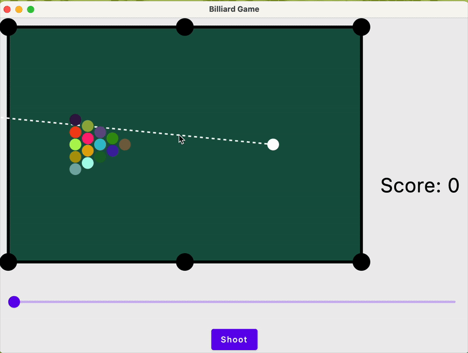

# Billiard
#### Billiard game with Jetpack Compose



## Run
* To run, execute:
    ```
    ./gradlew run
    ```

## Rules
* The goal of the game is to put as many colored balls into the pockets as possible;
* The white ball is a shooting (cue) ball
  * When this ball is pocketed, you lose and the game restarts;
* For each pocketed ball you get +1 score;
* When all balls are pocketed, you win and the game restarts.

## Getting Started
* First, setup shooting direction by pressing left button and dragging your mouse;
* Second, adjust the shooting ball force by moving the slider;
* Finally, press 'shoot' and enjoy 😜!
